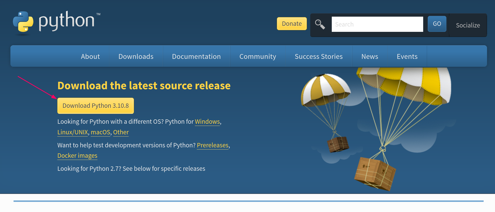
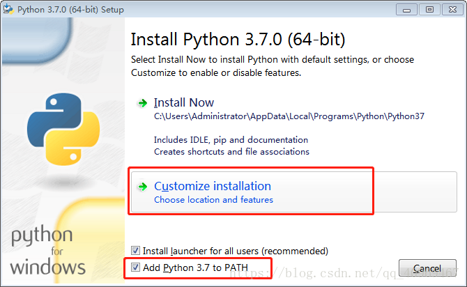
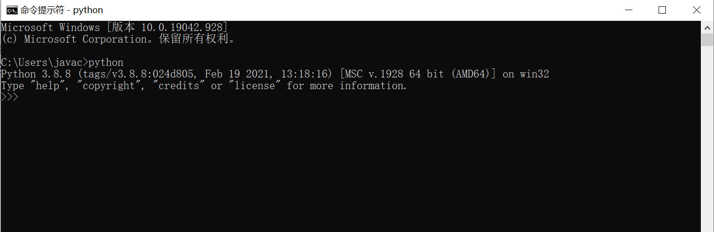
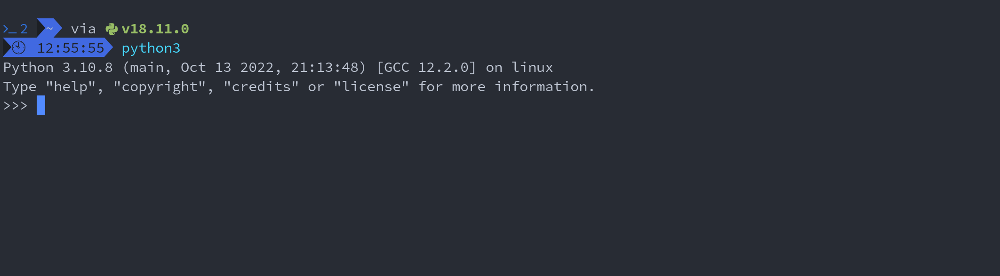

If you want to do a good job, you must use your tools first!!! 

Before learning to write code, we must first install all the necessary software and configure the development environment, only after these things are done can we implement the corresponding functions in code more efficiently. The environment configuration is described in detail here.

# Python Installation
Since you want to use Python, you need to download Python 3 from the official website.

[Python Official Website](https://www.python.org/) <br>
[Python Download Website](https://www.python.org/downloads/) <br>
[Python Official Docs)](https://docs.python.org/3/) <br>
[Python Modules Docs](https://pypi.org/)

<!-- tabs:start -->

#### **Windows Installation**

1. First go to the download page through the above download address and click the button

After downloading, double-click the installation package to start downloading python

2. There is one point to note here, **must be sure** to click the add to path option



3. Next verify that the download was successful
First click the win button (which is the key with a window pattern on the keyboard), type cmd, press enter, then type python and press enter to test whether python can be called, and the test result is as follows



#### **Linux Installation**

- CentOS, RedHat
```bash
sudo yum install -y https://centos7.iuscommunity.org/ius-release.rpm

sudo yum update

sudo yum install -y python35u python35u-libs python35u-devel python35u-pip
```

- Ubuntu,Debian
```bash
sudo apt-get install -y python3-dev build-essential libssl-dev libffi-dev libxml2 libxml2-dev libxslt1-dev zlib1g-dev libcurl4-openssl-dev

sudo apt-get install python3 

sudo apt-get install python3-pip
```

- Arch, Arco
```bash
sudo pacman -S python3 python3-pip
```

#### Test whether the installation is successful
Test the installation success on the command line



#### **MacOS Installation**

Anyone who uses MacOS should know brew, brew is a powerful software management tool under the Mac platform, the official website is https://brew.sh/

1. First execute the following command line to download brew
```bash
/bin/bash -c "$(curl -fsSL https://raw.githubusercontent.com/Homebrew/install/master/install.sh)"
```

2. Then use brew to install python
```bash
brew install python3
```

3. Test whether the installation is successful
```bash
~python3
python 3.6.1 (default, Apr 4 2017, 09:40:21)
[Gcc 4.2.1 Compatible Apple LLVM 8.1.0(clang-802.0.38)] on darwin
Type "help" , "copyright" "credits" or "license" for more information.
```
<!-- tabs:end -->
