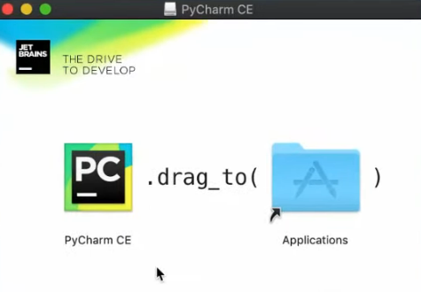
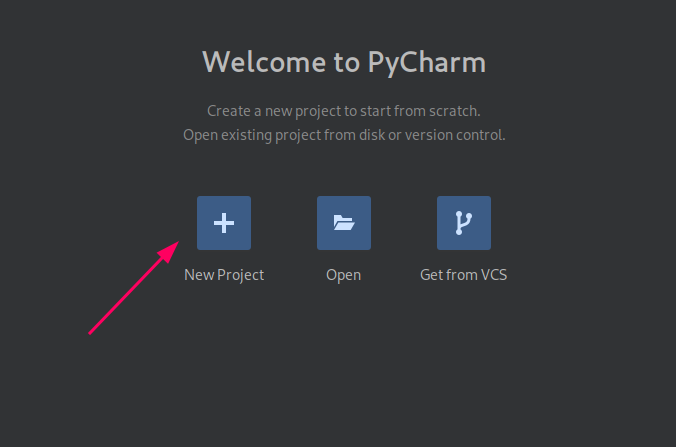
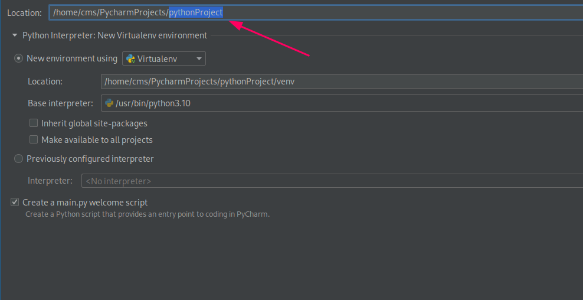
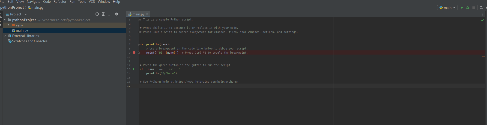
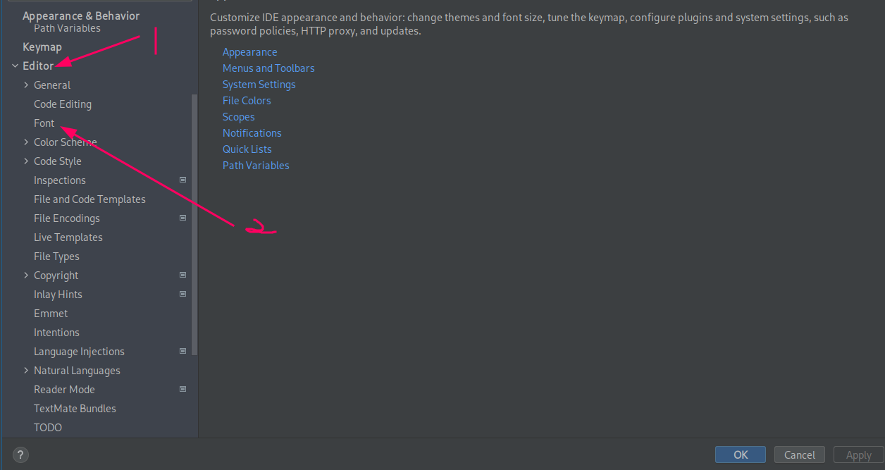
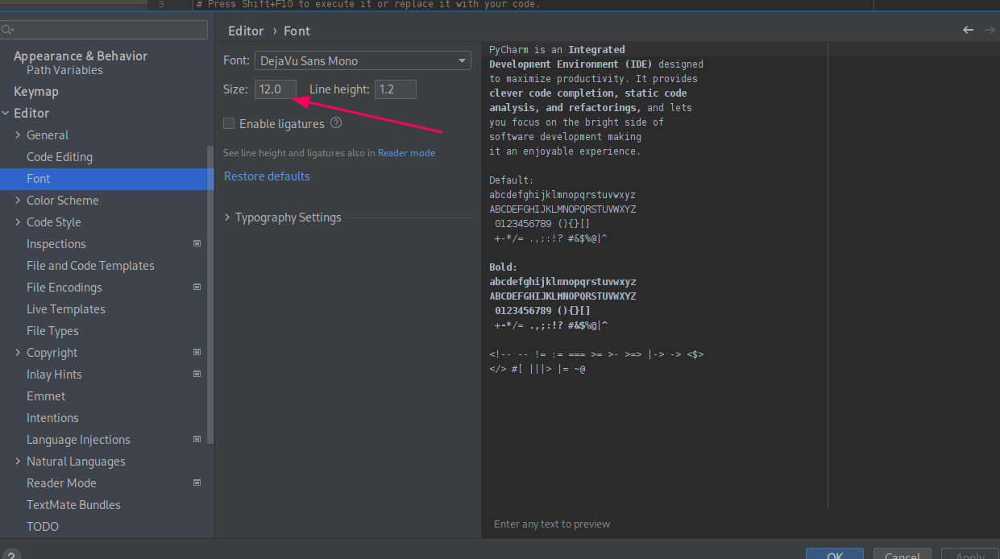
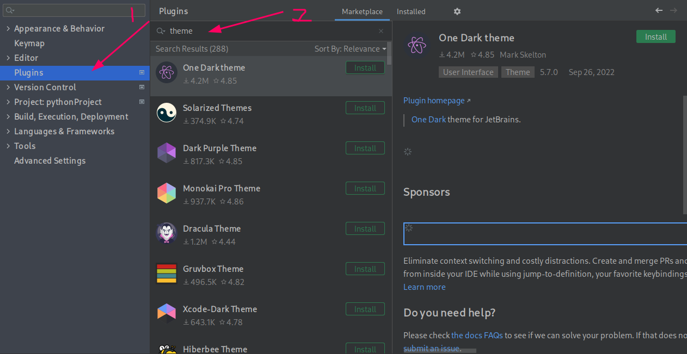
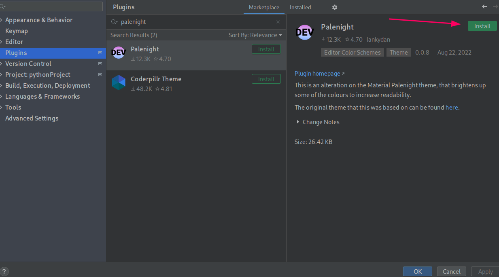
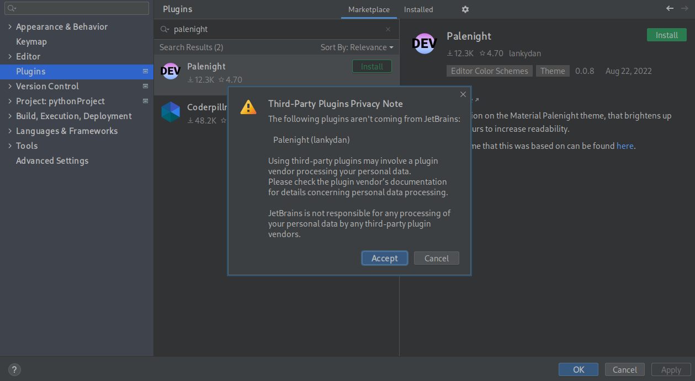

## Pycharm安装
首先，到[pycharm官网](https://www.jetbrains.com/pycharm/download/)

## 安装指南

<!-- tabs:start -->
### **Windows安装**
到了官网后选择社区版并下载，下载完后双击安装包并进入安装页面，后面一直按next就可以了

<br>
<div style="text-align:center;">
    </img>
</div>

这里可以选择自己要下载在哪里
<div style="text-align:center;">
    </img>
</div>

这里推荐除了第二行的选项外全部都勾选
<div style="text-align:center;">
    </img>
</div>

这里直接选Next就可以了
<div style="text-align:center;">
    </img>
</div>

接下来等它安装完就好了

### **Linux安装**

- Ubuntu, Debian, CentOS, Red Hat

首先到官网下载Linux版本的pycharm的社区版，然后打开终端输入

```bash
cd Downloads && tar xzf pycharm-*.tar.gz -C /opt/

cd /opt/pycharm-*/bin

chmod +x pycharm.sh

./pycharm.sh
```

?> 如果终端显示权限不足只需在前面加sudo就行了

<br><br>

- Arch, Arco

```bash
sudo pacman -S pycharm-community-edition
```

### **MacOS安装**
到了官网后选择社区版并下载

!> 这里注意，需要下载后缀为.dmg的那个

下载完成后,双击安装包(有些会自动打开),之后MacOS会显示一下图片

<div style="text-align:center;">
    </img>
</div>

这里只需要把pycharm的图标拖拽到右边显示的图标就可以了
<!-- tabs:end -->

## Pycharm配置

下载完pycharm之后我们还需要设置一些东西才能正式开始
当下载完之后，pycharm将会自动打开，这里点击New Project
<div style="text-align:center;">
    </img>
</div>

之后可以这这里设置你要的文件夹名字以及文件夹的位置
<div style="text-align:center;">
    </img>
</div>

第一次打开pycharm时一般上都是这样的
<div style="text-align:center;">
    </img>
</div>

这里就大致说一下一些pycharm的基础设置
首先，在左上角找到File > Settings
Windows用户可以使用快捷键 Ctrl + Alt + s (没有使用window manager的Linux用户也可以使用这个快捷键)

1. 这个页面可能一般人会觉得字太小了，看不清楚(反正卧室觉得太小了)，要设置字体大小的话首先找到Editor,然后找到Font
<div style="text-align:center;">
    </img>
</div>

这里就可以设置字体的大小了
<div style="text-align:center;">
    </img>
</div>

2. 可能有些人觉得这个pycharm的颜色不是很符合个人喜好，那么我们就可以下载插件来更换pycharm的主题
首先，找到Plugin,并在搜索栏输入theme(如果有个人喜欢的主题也可以尝试在这里找)
这里有很多不同主题，可以任意选择
<div style="text-align:center;">
    </img>
</div>

我个人比较喜欢palenight这个主题，所以这里我会下载palenight,选择好自己想要的主题后点击，并找到install然后点击
<div style="text-align:center;">
    </img>
</div>

!> 这里可能会跳出一个弹窗，只需点击Accept就可以了
<div style="text-align:center;">
    </img>
</div>

那么到这里，基本上就完成了,那么就可以开始写代码了