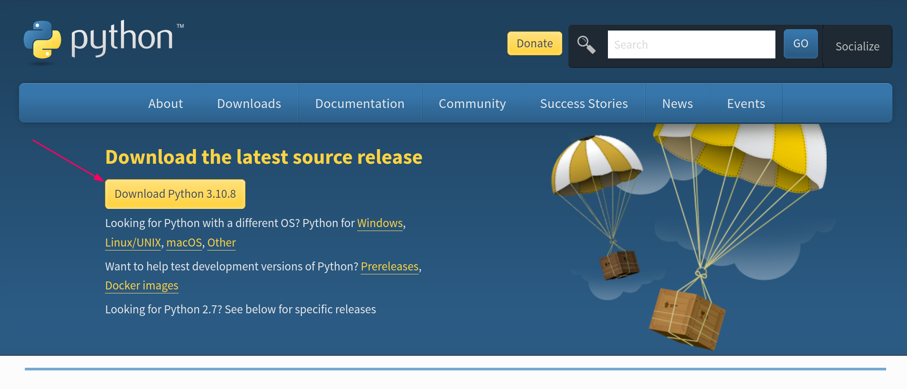
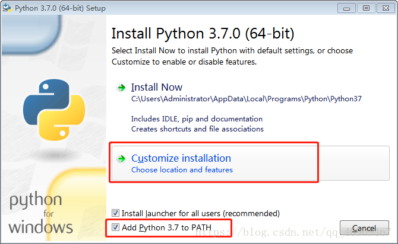
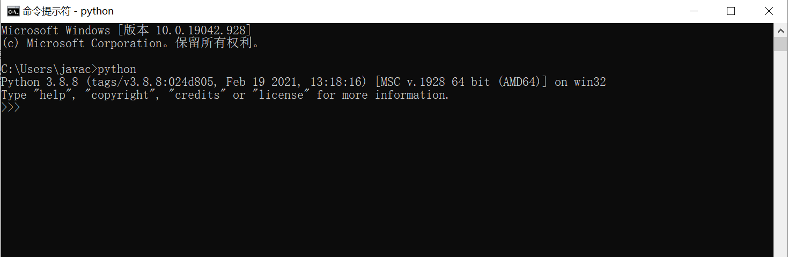
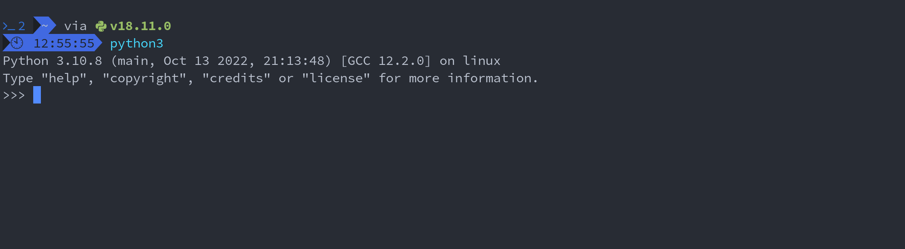

工欲善其事，必先利其器！！！

在学习编写代码之前，首先必须安装好所有必须的软件并将开发环境配置好，只有将这些事事情完成之后我们才能更高效地用代码实现相应的功能。这里会对环境配置进行详细说明。

# Python安装
既然要使用Python,那么就需要到官网下载Python3。

[Python官网](https://www.python.org/) <br>
[Python下载地址](https://www.python.org/downloads/) <br>
[Python官方文档(中文版)](https://docs.python.org/zh-cn/3/) <br>
[Python第三方库](https://pypi.org/)

## Windows安装
1. 首先通过以上的下载地址到下载页面并点击一下按钮

下载完后双击安装包开始下载python

2. 这里需要注意一个点，**一定一定**要点击add to path的选项



3. 接下来验证是否下载成功
首先点击win按键(就是键盘上有一个window图案的按键)，输入cmd，回车，之后输入python并回车测试一下能否调用python,测试成功结果如下



## Linux安装
- CentOS, RedHat
```bash
sudo yum install -y https://centos7.iuscommunity.org/ius-release.rpm

sudo yum update

sudo yum install -y python35u python35u-libs python35u-devel python35u-pip
```

- Ubuntu,Debian
```bash
sudo apt-get install -y python3-dev build-essential libssl-dev libffi-dev libxml2 libxml2-dev libxslt1-dev zlib1g-dev libcurl4-openssl-dev

sudo apt-get install python3 

sudo apt-get install python3-pip
```

- Arch, Arco
```bash
sudo pacman -S python3 python3-pip
```

#### 测试是否安装成功
在命令行中测试是否安装成功



## MacOS安装
使用MacOS应该都知道brew,brew是Mac平台下强大的软件管理工具，官方网站为

1. 首先执行一下命令行下载bew
```bash
/bin/bash -c "$(curl -fsSL https://raw.githubusercontent.com/Homebrew/install/master/install.sh)"
```

2. 接着就使用brew来安装python
```bash
brew install python3
```

3. 测试是否安装成功
```bash
~python3
python 3.6.1 (default, Apr 4 2017, 09:40:21)
[Gcc 4.2.1 Compatible Apple LLVM 8.1.0(clang-802.0.38)] on darwin
Type "help" , "copyright" "credits" or "license" for more information.
```